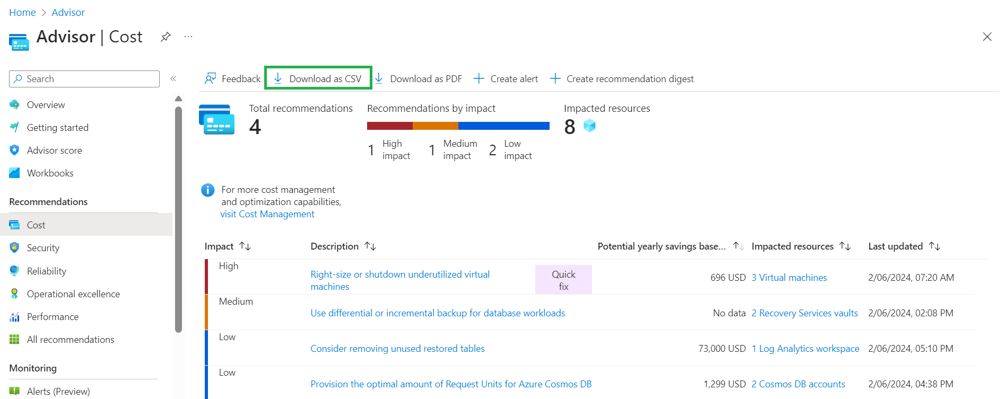

---
# Required metadata
# For more information, see https://learn.microsoft.com/en-us/help/platform/learn-editor-add-metadata
# For valid values of ms.service, ms.prod, and ms.topic, see https://learn.microsoft.com/en-us/help/platform/metadata-taxonomies

title: Azure Advisor recommendation state management
description: This article describes azure advisor recommendation state management and provides you with methods for use.
author:      zucatihal # GitHub alias
ms.author:   v-zucatihal # Microsoft alias
ms.service: azure-advisor
ms.topic: how-to
ms.date:     03/17/2026
ms.reviewer: tiffanywang, adaga
---

# Azure Advisor recommendation state management

With Azure Advisor recommendation state management capability, you can track and manage new and existing recommendations through their state lifecycle.

> [!NOTE]
>Azure Advisor recommendation state management is currently in Preview. Preview features are provided for evaluation purposes and may change before general availability.

## Recommendation state

Each Azure Advisor recommendation can have one of the 4 supported states:

- **Active**: New recommendations identified by the Azure Advisor system

- **Postponed**: Temporarily hide a recommendation for a set period. After that, it automatically reappears.

- **Dismissed**: Permanently remove an item from view until you choose to reactivate it.

- **Completed**: The recommended action has been successfully applied to the resource, or the recommendation no longer applies. You can mark a recommendation as completed manually, or Azure Advisor can automatically mark it as completed if it verifies that recommendation no longer applies.

These states show the status of each recommendation and are used to manage your recommendations as they transition through their lifecycle.

## Recommendation state transitions

Azure Advisor recommendations move through a simple lifecycle that helps you track progress and understand when no further action is required. You can manually manage recommendation states while Azure Advisor automatically verifies when a recommendation has been addressed or no longer applies.

## Manual state changes

When a recommendation is **Active**, you can manually update its state to manage your work:

- **Postponed**: Temporarily hide the recommendation and review it later.

- **Dismissed**: Indicate that the recommendation is not relevant.

- **Completed**: Indicate that you have taken the recommended action.

You can continue to change states between **Active**, **Postponed**, **Dismissed**, and **Completed**, or reactivate a recommendation, **until Azure Advisor performs system verification and Marks a recommendation as Completed**. Recommendations manually marked as completed are indicated as **Marked completed**.

## System verification

Azure Advisor performs automatic system verification every 24 hours to check whether a recommendation has been addressed or no longer applies to the resource.

- If Azure Advisor verifies that the recommended action has been applied, or that the recommendation no longer applies, the recommendation is marked as **Completed** and indicated with **System-verified**.

- If a recommendation was previously marked as **Completed** manually (**Marked by user**), and Azure Advisor later verifies it during system verification, the status automatically changes to **System verified**.

- Once a recommendation is **System verified**, the state becomes final and **can’t be changed or reactivated**.

- System‑verified completed recommendations remain available for viewing for __six months__, after which they’re automatically removed from the system.

> [!NOTE]
> Azure Advisor doesn’t require you to manually mark a recommendation as completed for it to be system verified. Advisor continuously performs automatic detection of >remediation for all recommendations. Advisor automatically marks a recommendation as __Completed (system verified)__ when the issue is resolved or no longer applies to a >resource.

## Heading 2 Procedure Title

Heading 2 Procedure Intro Sentence

1. Sign in to the [**Azure portal**](https://portal.azure.com).

1. Search for and select [**Advisor**](https://aka.ms/azureadvisordashboard) from any page.\
The Advisor **Overview** page opens.

1. Export cost recommendations by navigating to the **Cost** tab on the left navigation menu and choosing **Download as CSV**.

1. Use the cost savings amount for each recommendation to calculate aggregated potential yearly savings.

    
   
> [!NOTE]
> Different types of cost savings recommendations are generated using overlapping datasets (for example, VM rightsizing/shutdown, VM reservations and savings plan recommendations all consider on-demand VM usage). As a result, resource changes (e.g., VM shutdowns) or reservation/savings plan purchases will impact on-demand usage, and the resulting recommendations and associated savings forecast. 

