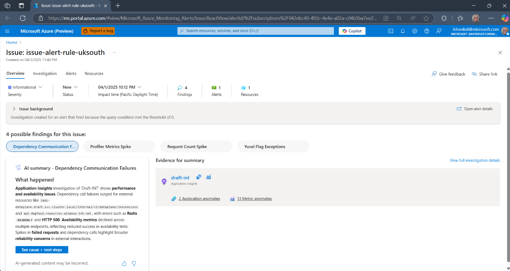
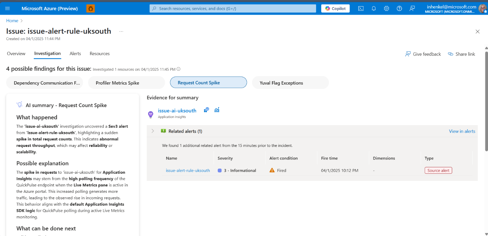

# Azure Monitor issue and investigation (preview)

This article explains what Azure Monitor issue and investigation is and how it's used to triage and mitigate problems with an Azure resource.

## What is Azure Monitor issue and investigation?

Azure Monitor issue and investigation is an AIOPs feature of Azure Monitor that can be triggered by an Azure Monitor alert.

> [!NOTE]
> For preview, the only alert supported is an Application Insights resource alert.

## What is an issue?

An issue contains all observability related data and processes for troubleshooting a service health degradation. It allows for keeping track of the mitigation of problems with resources. It can be shared and used by multiple people.

An issue presents an overview, the investigation, details about the alerts, and the resources involved.

You can set the severity, status, and impact time of an issue.

## What is an investigation?

An investigation is an analysis of a set of findings within the context of an issue. The analysis uses AI-based triage and diagnostic processes.

### Findings

Findings identify anomalous behavior that could explain an issue. They summarize the analysis of multiple anomalies (for example, 'VM performance is low due to possible memory leak’) based on relevant signals (metrics, logs, etc.) and might suggest further investigation steps and potential mitigations.​

A finding contains a summary that can include:

- **What happened.** A description of the issues with the resources included in the investigation.
- **A possible explanation.** A description of what might be causing problems.
- **Next steps.** Suggestions for digging deeper into the problems.
- **Evidence.** Every finding presents supporting evidence. Evidence is the data supporting the finding, such as anomalies, diagnostics insights, health data, resource changes, and related resources, related alerts, and data you define such as with a query.

> [!Note]
> Up to five findings groups are displayed and all other anomalies are grouped into **Additional data**.

## Evidence types

### Metric anomalies

The investigation:

- Scans the Azure resources in the investigation target and scope for anomalies in platform metrics and custom metrics.
- Assigns scores to metrics that show a correlation with the incident start time.
- Generates explanations for the incident by conducting sub-pattern analysis to explain anomalies based on metric dimensions or labels that generate the most impact.
-  Groups and ranks explanations to present the most likely causes

### Application logs Analysis

The investigation scans the application data for anomalies. The top three fail events (For dependencies, requests and exceptions) are analyzed. For each event:

- **Explanation**: An explanation of what happened is generated for the failure.
- **Transaction Examples**: A list of examples of transactions in which the specific failure event exists. Pressing on the example will display the end-to-end transaction in Application Insights.
- **Exceptions**: If there are specific exception problem IDs that correlate with the failure, they will be displayed with the count of appearance in the logs. The problem IDs are explained in natural language and an example is provided.
- **Transaction Pattern**: If there is a specific pattern the failure, it will be displayed. This can help explain the issue and show the root cause. If there are multiple transaction patterns, no pattern is displayed.
- **Trace Message Patterns**: If there are specific trace message patterns that correlate with the failure, they will be displayed with the count of appearance in the logs. The patterns are explained in natural language and an example is provided.

### Diagnostic insights

Provides actionable solutions and diagnostics based on abnormal telemetry from Azure support best practices, enhancing issue resolution efficiency.

### Related Alerts

Contains data from related alerts on the target resource that occurred in the last 15 minutes.

### Resource Health

Provides data from Azure Resource Health.

## Capabilities

### Configurable scope

Azure Monitor investigation makes suggestions for which resources to analyze based on the scope of the investigation. The default scope of an investigation includes all metrics of the resource. You can change the scope to include up to five resources. See Scope the investigation in [Use issue and investigation](aiops-issue-and-investigation-how-to.md).

### Smart scoping

Investigation also offers smart scoping for application insight resources. In this case we will automatically identify possible suspected resources from looking at the dependencies in Application Insights and run analysis on them as well.

## Issue and investigation initial workflow example

1. An alert email from Azure Monitor is received.
1. A click on the investigate button in the email creates an issue and starts an investigation. The issue page on the Azure portal opens in your browser.
1. On the Issue page, you are presented with:
    1. The issue overview where the findings are presented as well as the evidence.
    1. The investigation which contains the AI analysis summary, suggested actions to take and the evidence used for the analysis.
    1. Alerts associated with the issue
    1. Resources associated with the issue.

        

1.  Every finding in an investigation presents more details on the cause and present next steps to choose from.

    

## Regions

| **Public preview region availability** |
|----------------------------------------|
| australiaeast                          |
| centralindia                           |
| centralus                              |
| eastasia                               |
| eastus                                 |
| eastus2euap                            |
| uksouth                                |
| westeurope                             |
| westus                                 |

## Next steps

- [How to use Azure Monitor issues and investigation](aiops-issue-and-investigation-how-to.md)
- [Azure Monitor issue and investigation (preview) responsible use](aiops-issue-and-investigation-responsible-use.md)
