# Azure Monitor Knowledge Graph

This knowledge graph represents the comprehensive architecture and relationships within Azure Monitor based on the complete documentation analysis.

```mermaid
flowchart TD
    %% Core Azure Monitor Platform
    AzureMonitor["Azure Monitor<br/>Platform"]
    
    %% Data Sources Layer
    subgraph DataSources ["🔌 Data Sources"]
        direction TB
        Azure["Azure Resources<br/>- Platform Metrics<br/>- Activity Logs<br/>- Resource Logs"]
        VM["Virtual Machines<br/>- Host Metrics<br/>- Guest OS Data"]
        Apps["Applications<br/>- Performance<br/>- Dependencies<br/>- Custom Events"]
        Containers["Containers<br/>- AKS<br/>- Docker<br/>- Kubernetes"]
        Infrastructure["Infrastructure<br/>- On-premises<br/>- Multi-cloud<br/>- Hybrid"]
        Custom["Custom Sources<br/>- REST API<br/>- Logs Ingestion API"]
    end
    
    %% Data Collection
    subgraph DataCollection ["📥 Data Collection & Routing"]
        direction TB
        AMA["Azure Monitor Agent<br/>- Windows/Linux<br/>- VM Extension<br/>- Client Installer"]
        LegacyAgent["Legacy Agents<br/>- Log Analytics Agent<br/>- Diagnostics Extension"]
        AppInsights["Application Insights<br/>- SDK<br/>- Auto-instrumentation<br/>- OpenTelemetry"]
        DCR["Data Collection Rules<br/>- Configuration<br/>- Transformations<br/>- Filtering"]
        DCE["Data Collection Endpoints<br/>- Regional Endpoints<br/>- Private Link"]
        DiagSettings["Diagnostic Settings<br/>- Resource Logs<br/>- Platform Metrics"]
    end
    
    %% Data Platform
    subgraph DataPlatform ["💾 Data Platform"]
        direction TB
        Metrics["Azure Monitor Metrics<br/>- Platform Metrics<br/>- Custom Metrics<br/>- Prometheus Metrics"]
        Logs["Azure Monitor Logs<br/>- Log Analytics Workspaces<br/>- KQL Queries<br/>- Tables"]
        Traces["Distributed Traces<br/>- Application Map<br/>- End-to-end Tracing"]
        Changes["Change Analysis<br/>- Resource Changes<br/>- Application Changes"]
        Storage["Azure Storage<br/>- Long-term Archive<br/>- Compliance"]
    end
    
    %% Consumption Layer
    subgraph Consumption ["📊 Analysis & Consumption"]
        direction TB
        
        subgraph AnalysisTools ["Analysis Tools"]
            direction TB
            Portal["Azure Portal<br/>- Monitor Section<br/>- Resource Insights"]
            MetricsExplorer["Metrics Explorer<br/>- Chart Creation<br/>- Filtering"]
            LogAnalytics["Log Analytics<br/>- KQL Editor<br/>- Query Results"]
            ChangeAnalysis["Change Analysis<br/>- Timeline View<br/>- Impact Analysis"]
            Insights["Insights<br/>- VM Insights<br/>- Container Insights<br/>- Application Insights<br/>- Network Insights"]
        end
        
        subgraph VisualizationTools ["Visualization Tools"]
            direction TB
            Dashboards["Azure Dashboards<br/>- Custom Views<br/>- Shared Dashboards"]
            Workbooks["Azure Workbooks<br/>- Interactive Reports<br/>- Templates"]
            PowerBI["Power BI<br/>- Business Analytics<br/>- Data Export"]
            Grafana["Azure Managed Grafana<br/>- Open Source<br/>- Multi-cloud Views"]
        end
        
        subgraph ResponseTools ["Automated Response"]
            direction TB
            Alerts["Azure Monitor Alerts<br/>- Metric Alerts<br/>- Log Search Alerts<br/>- Activity Log Alerts<br/>- Smart Detection"]
            ActionGroups["Action Groups<br/>- Email/SMS<br/>- Webhooks<br/>- Logic Apps<br/>- ITSM"]
            Autoscale["Autoscale<br/>- VM Scale Sets<br/>- App Service<br/>- Custom Resources"]
            AIOps["Azure Monitor AIOps<br/>- Machine Learning<br/>- Anomaly Detection<br/>- Issue Investigation"]
        end
    end
    
    %% Integration & Export
    subgraph Integration ["🔗 Integration & Export"]
        direction TB
        EventHubs["Azure Event Hubs<br/>- Streaming Export<br/>- SIEM Integration"]
        LogicApps["Azure Logic Apps<br/>- Workflow Automation<br/>- Custom Actions"]
        Functions["Azure Functions<br/>- Custom Processing<br/>- Serverless Actions"]
        API["Azure Monitor APIs<br/>- REST API<br/>- Data Export<br/>- Custom Solutions"]
        Partners["Partner Solutions<br/>- Datadog<br/>- Elastic<br/>- Dynatrace"]
        ITSM["ITSM Connector<br/>- ServiceNow<br/>- Incident Management"]
    end
    
    %% Specialized Monitoring
    subgraph SpecializedMonitoring ["🎯 Specialized Monitoring"]
        direction TB
        
        subgraph ApplicationMonitoring ["Application Monitoring"]
            direction TB
            OpenTelemetry["OpenTelemetry<br/>- .NET Distro<br/>- Java Distro<br/>- Node.js Distro<br/>- Python Distro"]
            SDKs["Application Insights SDKs<br/>- Classic API<br/>- Legacy Support"]
            JavaScript["JavaScript SDK<br/>- Browser Monitoring<br/>- Client-side Telemetry"]
            Profiler["Application Profiler<br/>- Performance Analysis<br/>- Code Optimization"]
            Snapshot["Snapshot Debugger<br/>- Exception Analysis<br/>- Debug Sessions"]
            LiveMetrics["Live Metrics<br/>- Real-time Monitoring<br/>- Quick Diagnostics"]
        end
        
        subgraph VMMonitoring ["VM Monitoring"]
            direction TB
            VMInsights["VM Insights<br/>- Performance Monitoring<br/>- Dependency Mapping"]
            DependencyAgent["Dependency Agent<br/>- Service Map<br/>- Process Monitoring"]
            Heartbeat["Agent Heartbeat<br/>- Health Monitoring<br/>- Availability Tracking"]
            GuestOS["Guest OS Monitoring<br/>- Performance Counters<br/>- Event Logs<br/>- Syslog"]
        end
        
        subgraph ContainerMonitoring ["Container Monitoring"]
            direction TB
            ContainerInsights["Container Insights<br/>- AKS Monitoring<br/>- Container Logs<br/>- Resource Usage"]
            Prometheus["Prometheus Metrics<br/>- Azure Monitor Workspace<br/>- Managed Prometheus"]
            NetworkMonitoring["Network Monitoring<br/>- Flow Logs<br/>- Network Policies"]
        end
    end
    
    %% Enterprise & Management
    subgraph EnterpriseManagement ["🏢 Enterprise & Management"]
        direction TB
        
        subgraph Security ["Security & Compliance"]
            direction TB
            Sentinel["Microsoft Sentinel<br/>- SIEM Integration<br/>- Security Analytics"]
            Defender["Microsoft Defender<br/>- Security Monitoring<br/>- Threat Detection"]
            PrivateLink["Azure Private Link<br/>- Network Isolation<br/>- Secure Communication"]
            ManagedIdentity["Managed Identity<br/>- Authentication<br/>- Authorization"]
        end
        
        subgraph CostManagement ["Cost Management"]
            direction TB
            DataRetention["Data Retention<br/>- Lifecycle Policies<br/>- Archive Tiers"]
            Sampling["Sampling<br/>- Ingestion Control<br/>- Cost Optimization"]
            DailyCap["Daily Cap<br/>- Spending Limits<br/>- Budget Alerts"]
            Transformation["Data Transformation<br/>- Filtering<br/>- Column Removal"]
        end
        
        subgraph Enterprise ["Enterprise Features"]
            direction TB
            MultiTenant["Multi-tenant Support<br/>- Cross-tenant Queries<br/>- Azure Lighthouse"]
            RBAC["Role-based Access<br/>- Permissions<br/>- Security Boundaries"]
            Replication["Workspace Replication<br/>- Cross-region Backup<br/>- Disaster Recovery"]
            Architecture["Enterprise Architecture<br/>- At-scale Monitoring<br/>- Governance"]
        end
    end
    
    %% Main Data Flow Connections
    DataSources --> DataCollection
    DataCollection --> DataPlatform
    DataPlatform --> Consumption
    DataPlatform --> Integration
    DataPlatform --> SpecializedMonitoring
    Integration --> EnterpriseManagement
    
    %% Detailed Data Source Connections
    VM --> AMA
    Apps --> AppInsights
    Azure --> DiagSettings
    Containers --> ContainerInsights
    Infrastructure --> AMA
    Custom --> API
    
    %% Data Collection to Platform Connections
    AMA --> DCR
    DCR --> DCE
    AppInsights --> Traces
    DiagSettings --> Logs
    DCR --> Logs
    
    %% Platform to Analysis Connections
    Logs --> LogAnalytics
    Metrics --> MetricsExplorer
    Traces --> AnalysisTools
    Changes --> ChangeAnalysis
    
    %% Analysis to Response Connections
    AnalysisTools --> Alerts
    Metrics --> Alerts
    Logs --> Alerts
    Alerts --> ActionGroups
    ActionGroups --> Autoscale
    
    %% Visualization Connections
    Metrics --> Autoscale
    Logs --> Workbooks
    Metrics --> Dashboards
    
    %% Integration Connections
    DataPlatform --> EventHubs
    EventHubs --> Partners
    ActionGroups --> LogicApps
    ActionGroups --> Functions
    
    %% Application Monitoring Connections
    Apps --> OpenTelemetry
    Apps --> SDKs
    Apps --> JavaScript
    OpenTelemetry --> Traces
    SDKs --> Traces
    JavaScript --> Traces
    
    AppInsights --> Profiler
    AppInsights --> Snapshot
    AppInsights --> LiveMetrics
    
    %% VM Monitoring Connections
    VM --> VMInsights
    VMInsights --> DependencyAgent
    AMA --> Heartbeat
    AMA --> GuestOS
    
    %% Container Monitoring Connections
    Containers --> Prometheus
    ContainerInsights --> NetworkMonitoring
    
    %% Security Connections
    Logs --> Sentinel
    Azure --> Defender
    DCE --> PrivateLink
    AMA --> ManagedIdentity
    
    %% Cost Management Connections
    Logs --> DataRetention
    AppInsights --> Sampling
    Logs --> DailyCap
    DCR --> Transformation
    
    %% Enterprise Connections
    Logs --> MultiTenant
    AzureMonitor --> RBAC
    Logs --> Replication
    AzureMonitor --> Architecture
    
    %% Styling
    classDef platform fill:#e1f5fe
    classDef datasource fill:#f3e5f5
    classDef collection fill:#fff3e0
    classDef storage fill:#e8f5e8
    classDef consumption fill:#fff8e1
    classDef integration fill:#e3f2fd
    classDef specialized fill:#fdf7f0
    classDef enterprise fill:#fafafa
    
    class AzureMonitor platform
    class Azure,VM,Apps,Containers,Infrastructure,Custom datasource
    class AMA,LegacyAgent,AppInsights,DCR,DCE,DiagSettings collection
    class Metrics,Logs,Traces,Changes,Storage storage
    class Portal,MetricsExplorer,LogAnalytics,ChangeAnalysis,Insights,Dashboards,Workbooks,PowerBI,Grafana,Alerts,ActionGroups,Autoscale,AIOps consumption
    class EventHubs,LogicApps,Functions,API,Partners,ITSM integration
    class OpenTelemetry,SDKs,JavaScript,Profiler,Snapshot,LiveMetrics,VMInsights,DependencyAgent,Heartbeat,GuestOS,ContainerInsights,Prometheus,NetworkMonitoring specialized
    class Sentinel,Defender,PrivateLink,ManagedIdentity,DataRetention,Sampling,DailyCap,Transformation,MultiTenant,RBAC,Replication,Architecture enterprise
```

## Key Relationships & Data Flows

### 1. Data Collection Architecture
- **Azure Monitor Agent (AMA)** is the modern, unified agent for VM monitoring
- **Data Collection Rules (DCRs)** define what data to collect, how to transform it, and where to send it
- **Data Collection Endpoints (DCEs)** provide regional and private connectivity
- **Application Insights** handles application telemetry via SDKs or OpenTelemetry

### 2. Data Platform Storage
- **Azure Monitor Metrics**: Time-series data for platform and custom metrics
- **Azure Monitor Logs**: Structured and unstructured log data in Log Analytics workspaces
- **Distributed Traces**: End-to-end request tracking across services
- **Change Analysis**: Resource and application change tracking

### 3. Analysis & Visualization
- **Log Analytics**: KQL-based querying and analysis
- **Metrics Explorer**: Time-series data analysis and charting
- **Insights**: Curated monitoring experiences for specific services
- **Workbooks**: Interactive, customizable reports and dashboards

### 4. Automated Response
- **Alerts**: Proactive notification system with multiple alert types
- **Action Groups**: Centralized response actions (email, SMS, webhooks)
- **Autoscale**: Dynamic resource scaling based on metrics
- **AIOps**: Machine learning-powered anomaly detection

### 5. Integration Ecosystem
- **Event Hubs**: Real-time data streaming for external systems
- **Partner Solutions**: Native integrations with observability vendors
- **APIs**: Programmatic access for custom solutions
- **ITSM Connectors**: Integration with IT service management tools

### 6. Application Monitoring Stack
- **OpenTelemetry**: Modern, vendor-neutral instrumentation
- **Application Insights SDKs**: Legacy but feature-rich monitoring
- **Live Metrics**: Real-time application performance monitoring
- **Profiler & Snapshot Debugger**: Deep application diagnostics

### 7. Security & Compliance
- **Azure Private Link**: Network isolation for sensitive environments
- **Microsoft Sentinel**: SIEM integration for security analytics
- **Role-based Access Control**: Granular permission management
- **Data Retention Policies**: Compliance and cost management

This knowledge graph represents the complete Azure Monitor ecosystem as documented, showing how all components interconnect to provide comprehensive observability across Azure and hybrid environments.
