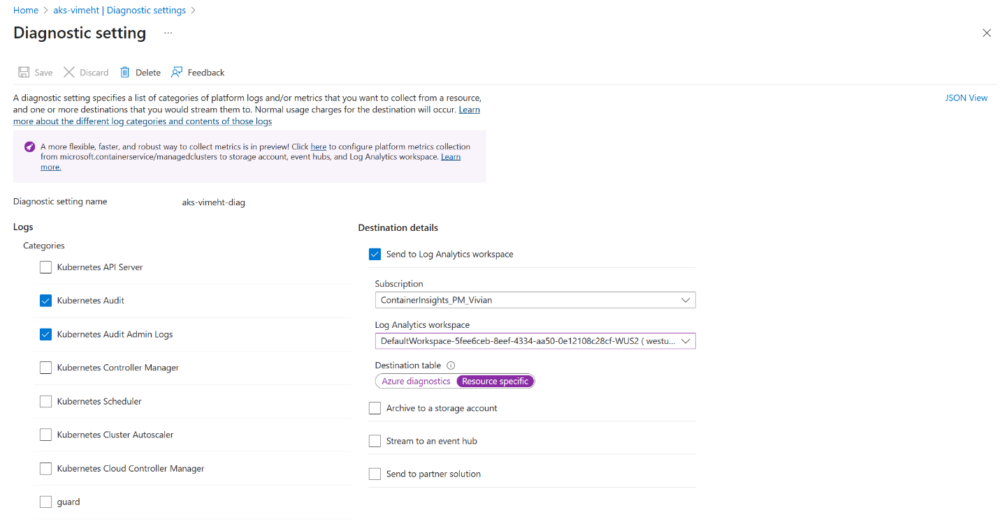
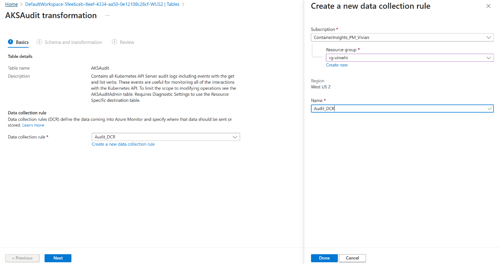
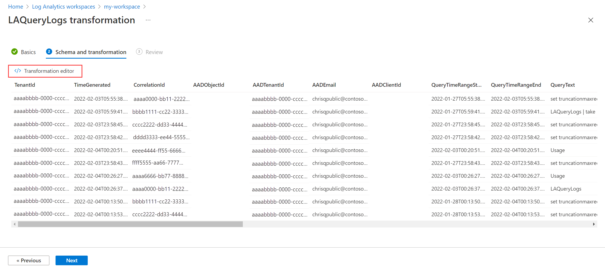

# Filter AKS control plane logs using workspace transformations in Azure Monitor

This tutorial walks through configuration of a sample transformation in a workspace [data collection rule (DCR)](../data-collection/data-collection-rule-overview.md) using the Azure portal. [Transformations](https://learn.microsoft.com/en-us/azure/azure-monitor/essentials/data-collection-transformations) in Azure Monitor allow you to filter or modify incoming data before it's sent to its destination. Workspace transformations provide support for [ingestion-time transformations](https://learn.microsoft.com/en-us/azure/azure-monitor/essentials/data-collection-transformations) for workflows that don't yet use the [Azure Monitor data ingestion pipeline](https://learn.microsoft.com/en-us/azure/azure-monitor/essentials/data-collection).

## Workspace Transformation DCR
A workspace transformation DCR is a special DCR attached to your workspace. It allows you to apply ingestion‑time KQL transforms to supported tables even when data is sent from diagnostic settings or other non‑DCR flows. You can define multiple transformation rules—one per table—in the same DCR. **[Learn More](../data-collection/data-collection-transformations.md#workspace-transformation-dcr)**.

> [!NOTE]
> This tutorial uses the Azure portal to configure a workspace transformation. For the same tutorial using Azure Resource Manager templates and REST API, see [**Tutorial: Add transformation in workspace data collection rule to Azure Monitor using resource manager templates**](../logs/tutorial-workspace-transformations-api.md).

**In this tutorial, you learn how to:**

- Create ingestion‑time transformation rules for AKS control plane tables.
- Filter out noisy or low‑value control‑plane events (e.g., ListPods, GetConfigMap).
- Validate filtering and monitor ingestion volumes.

## Prerequisites

To complete this tutorial, you need:

- A Log Analytics workspace where you have at least [contributor rights](../logs/manage-access.md#azure-rbac).
- [Permissions to create DCR objects](../data-collection/data-collection-rule-create-edit.md#permissions) in the workspace.
- Diagnostic settings sending `AKSAudit`, `AKSAuditAdmin`, and/or `AKSControlPlane` logs to the workspace.
- Some existing control‑plane log entries in those tables.
- No existing Workspace DCR linked yet (if applying transformations via portal first time)

## Overview

Azure Kubernetes Service (AKS) emits several types of control plane logs that help organizations monitor, audit, and troubleshoot cluster activity. These logs—such as `AKSAudit`, `AKSAuditAdmin`, and
`AKSControlPlane` capture a wide range of events including user operations, system activity, and high-privilege administrative actions. 

While these logs are valuable for security and compliance, they can quickly become high-volume and expensive to store—especially in clusters with frequent read operations or automated scripts. Many of these events (e.g., ListPods, GetConfigMap) are rarely used in queries, dashboards, or alerts and can safely be filtered out to reduce ingestion costs.

**Ingestion-time transformations** allow you to selectively filter or shape incoming log data before it’s stored in your Log Analytics workspace. This helps you reduce noise, optimize storage costs, and retain only the events that are meaningful to your team

## Enable Control Plane Logs for Ingestion

Before applying ingestion-time transformations, ensure that your AKS cluster is sending the relevant control plane logs to your Log Analytics workspace. This setup allows the transformation engine to receive and process data from tables like AKSAudit, AKSAuditAdmin, and AKSControlPlane.

This step is only required if you're not already collecting these logs. If your workspace is already receiving AKS control plane logs, you can skip to the next section.

1.  In the **Azure portal**, go to your **AKS cluster**.
2.  Under **Monitoring**, select **Diagnostic settings**.
3.  Click **+ Add diagnostic setting**.

4.  Enter a name for the diagnostic setting, such as AKSControlPlaneLogs.

5.  Under **Destination details**, select:
    - **Send to Log Analytics workspace**
    - Choose the same workspace where you’ll configure the transformation

6.  Under **Log categories**, check the boxes for:

    - **KubernetesAudit**
    - **KubernetesAuditAdmin**
    - **KubernetesControlPlane**

>  alt="A screenshot of a computer AI-generated content may be incorrect." />

7.  Click **Save**.

## Add a transformation to the table

1.  In the Azure portal, go to your Log Analytics workspace, and select
    Tables in the left-hand menu.

2.  Find AKSAudit in the list and click Create transformation.

3.  Because this is your first such rule, you'll be prompted to create a
    new workspace transformation DCR. Give it a name, then click Done
    and Next

4.  Select **Next** to view sample data from the table. As you define the transformation, the result will be applied to the sample data. For this reason, you can evaluate the results before you apply it to  actual data. Select **Transformation editor** to define the transformation.

5.  In the transformation editor:

source

\| where OperationName !in~ ("ListPods", "GetConfigMap",
"GetDeployment")

- source represents the incoming log data.

- This rule drops common low-value operations and retains other events.

You can modify this KQL to filter by ResourceGroupName, Identity,
StatusCode, or other fields.

Run the preview to validate that rows are dropped as expected.

6.  Select **Apply** to save the transformation and then
    select **Next** to review the configuration. Select **Create** to
    update the DCR with the new transformation.

## Validate the transform 

1.  Wait 30 minutes for rules to take effect.

2.  In Logs, run comparisons before and after:

AKSAudit \| summarize count() by OperationName

AKSAuditAdmin \| summarize count() by OperationName

AKSControlPlane \| summarize count() by EventType

3.  Verify volume drops and that key operations still appear.

## Cost Insights

Azure Monitor charges for data ingested into the workspace and for
processing transformations. If your rule drops \>50% of incoming data,
[a **processing charge** may
apply](https://learn.microsoft.com/en-us/azure/azure-monitor/data-collection/data-collection-transformations?utm_source=chatgpt.com#cost-for-transformations).
However, if Microsoft Sentinel is enabled on the workspace,
**transformation processing charges are waived**.

## Troubleshooting

- **Transformation syntax errors**: will be shown in the wizard preview
  before applying.

- **Missing new columns in IntelliSense**: may take up to 24 hours to
  update after transformation adds schema changes.

- **Dynamic column issues**: use parse_json() before operations on
  dynamic fields.

- Monitor workspace health and ingestion metrics to ensure volumes drop
  as expected.

##  Next steps

- [Learn more about data collection rules
  (DCRs)](https://learn.microsoft.com/en-us/azure/azure-monitor/data-collection/data-collection-rule-overview).

- [Learn about other Container Insights cost optimization
  tools](https://learn.microsoft.com/en-us/azure/azure-monitor/containers/container-insights-cost)
