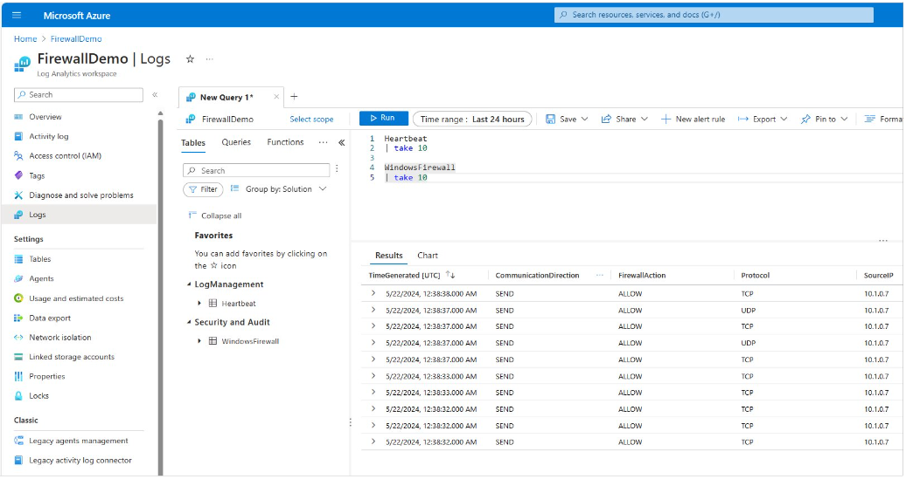

# Verify data collection with Azure Monitor agent

## Windows events

## Sample Syslog log queries

The following table provides different examples of log queries that retrieve Syslog records.

| Description | Query |
|:---|:---|
| All Syslogs | `Syslog` |
| All Syslog records with severity of error | `Syslog | where SeverityLevel == "error"` |
| All Syslog records with auth facility type | `Syslog | where facility == "auth"` |
| Count of Syslog records by facility | `Syslog | summarize AggregatedValue = count() by facility` |


## IIS logs
Different examples of log queries that retrieve IIS log records are shown in the following table:

| Description | Query |
|:---|:---|
| All IIS log records. | `W3CIISLog` |
| All IIS log records with a return status of 500. | `W3CIISLog | where scStatus==500` |
| Count of IIS log entries by client IP address. | `W3CIISLog | summarize count() by cIP` |
| Count of IIS log entries by URL for the host www\.contoso.com. | `W3CIISLog | where csHost=="www\.contoso.com" | summarize count() by csUriStem` |
| Total bytes received by each IIS computer. | `W3CIISLog | summarize sum(csBytes) by Computer | take 500000` |

## Performance data

| Description | Query |
|:---|:---|
| All performance data from a particular computer | `Perf | where Computer == "MyComputer"` |
| Average CPU utilization across all computers | `Perf | where ObjectName == "Processor" and CounterName == "% Processor Time" and InstanceName == "_Total" | summarize AVGCPU = avg(CounterValue) by Computer` |
| Hourly average, minimum, maximum, and 75-percentile CPU usage for a specific computer | `Perf | where CounterName == "% Processor Time" and InstanceName == "_Total" and Computer == "MyComputer" | summarize ["min(CounterValue)"] = min(CounterValue), ["avg(CounterValue)"] = avg(CounterValue), ["percentile75(CounterValue)"] = percentile(CounterValue, 75), ["max(CounterValue)"] = max(CounterValue) by bin(TimeGenerated, 1h), Computer` |

> [!NOTE]
> Additional query examples are available at [Queries for the Perf table](/azure/azure-monitor/reference/queries/perf).

## Text logs

## JSON logs

## Windows firewall logs

Count the firewall log entries by URL for the host www.contoso.com.
    
```kusto
WindowsFirewall 
| take 10
```

[  ](media/data-collection-firewall-log/law-query-results.png#lightbox)


## Next steps

