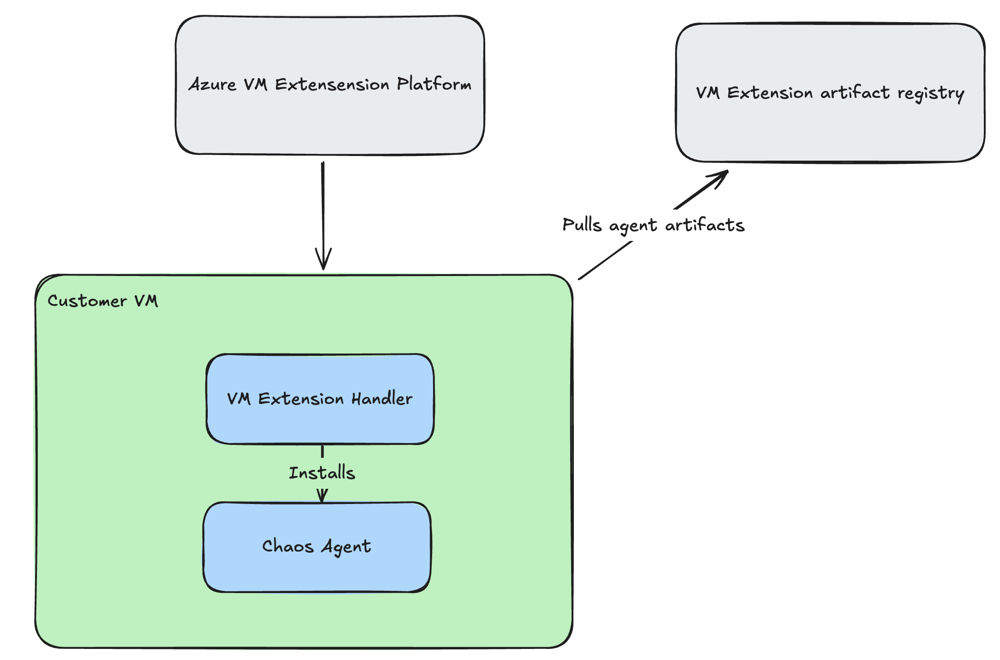
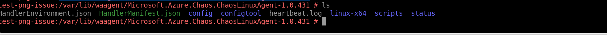

# Agent Concepts

This document provides a deep dive into the **Chaos Agent** within Azure Chaos Studio. It explains how the agent works, its network access requirements, dependencies, and security considerations, ensuring that you have the information needed to properly deploy and maintain the agent in your environment.

## Network Access

To function correctly, the Chaos Agent requires outbound connectivity to the Chaos Studio service endpoints. Specifically, the VM must be able to reach:
```
https://<region>.agents.chaos-prod.azure.com
```
Without this connectivity, the agent won't receive instructions or be able to report its status. Other network configuration points include:

- **NSG Configuration:** Use the **ChaosStudio** service tag to allow outbound traffic in Network Security Groups.
- **Private Connectivity:** Private Link can be configured for fully private connectivity. For more details, review the [Chaos Studio private link for agent documentation](chaos-studio-private-link-agent-service.md).

## Security

Security is a primary consideration in the design of the Chaos Agent:

- **Managed Identity:** The agent uses Azure Managed Identity for authentication, eliminating the need to store secrets on the VM.
- **Role-based access Controls (RBAC):** All chaos actions are initiated by the user’s experiment, and Azure RBAC ensures that only authorized fault operations are executed.

For more security best practices and troubleshooting tips, refer to the [Chaos Studio permissions security](chaos-studio-permissions-security.md).

## Other Considerations
- **Application Insights**
  - Connect your agent-based fault injection experiment with App Insights in order to have richer data populated about the experiment you're running.
 
## Dependencies

The proper operation of the Chaos Agent depends on several software components and system configurations:

- **Linux Dependencies:**  
  - Some agent-based faults require different dependencies. For example, resource pressure faults depend on the `stress-ng` utility. 
  - The installer attempts to autoinstall `stress-ng` `tc` and `netem` on auto install supported distributions such as Debian/Ubuntu, RHEL, and openSUSE.  
  - For certain distributions like Azure Linux (Mariner), manual installation of dependencies is necessary.
  - For more info on dependencies, see our [OS compatibility page](chaos-agent-os-support.md)

- **OS-Specific Logging:**  
  - **Windows:** Utilizes the Windows Event Log for logging.  
  - **Linux:** Uses the systemd journal for logging.

Further details can be found in the [Chaos Studio fault library documentation](chaos-studio-fault-library.md). 

## Architecture

The Chaos Agent runs as a background service on the virtual machine (VM) and is deployed via a VM extension. Depending on the operating system:


- **Windows:** Operates as a Windows service.
- **Linux:** Runs as a systemd service.

The agent authenticates with Azure Chaos Studio using a user-assigned managed identity attached to the VM. It communicates with the Chaos Studio backend to receive fault execution commands. Key aspects include:

- **Target Identity:** The identity of the VM that is being targeted.
- **Experiment Managed Identity:** Must have at least Reader access on the VM to execute faults.

### VM Extension diagram

Imagine you have installed the chaos studio extension by triggering our agent-based faults. The following diagram displays how this installation would proceed. 

<br>[](images/chaos-vm-extension-diagram.png#lightbox)<br>

For more details on installation and identity requirements see the [Chaos Studio permissions security](chaos-studio-permissions-security.md).

## Filepath of installed files

The agent attempts to install itself and its dependencies in the following filepaths:

- **Windows:** ```C:\Packages\Plugins\Microsoft.Azure.Chaos.ChaosWindowsAgent\<version>```
- **Linux:** ```/var/lib/waagent/Microsoft.Azure.Chaos.ChaosLinuxAgent-<version>```
- **Linux Dependencies:** Installed in the linux-x64 folder at the above location

<br>[](images/chaos-agent-linux-filepath-example.png#lightbox)<br>

## Additional Concepts

- **Monitoring and Logging:**  
  - Ensure your monitoring solutions capture logs from the Windows Event Log or the Linux systemd journal to diagnose issues effectively.
  
- **Network Diagnostics:**  
  - Regularly verify that NSG rules and firewall settings permit outbound traffic to the required Chaos Agent service endpoints.
  
- **Identity and Access Reviews:**  
  - Periodically review the permissions assigned to both the target identity and the experiment managed identity to adhere to the principle of least privilege.
  
- **Maintenance and Updates:**  
  - Keep the agent and its dependencies up-to-date to benefit from performance improvements and security patches.

These concepts should help you understand how things work so you can configure, deploy, and troubleshoot the Chaos Agent effectively within your Azure environment.

