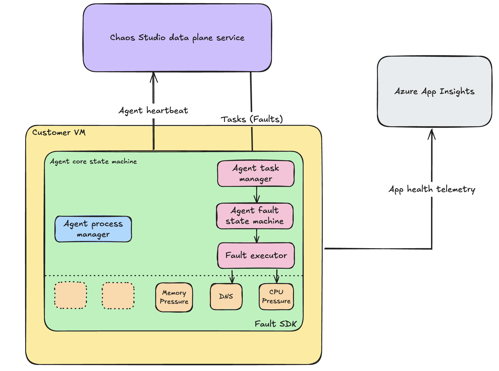

# Chaos Studio agent overview

The Chaos Studio agent is a component that runs inside your virtual machines (VMs) to inject faults that can't be achieved through the Azure control plane alone. Faults like CPU pressure, memory pressure, and network latency require in-guest access to the operating system — the agent provides that access.

The agent is delivered as a VM extension and supports both Windows and Linux. After deployment, it uses a user-assigned managed identity attached to the VM to authenticate with Azure Chaos Studio and execute fault actions. For identity setup details, see [Agent concepts](chaos-agent-concepts.md).

## What the agent enables

The agent supports fault types that operate at the OS level:

- **CPU pressure** — Drives CPU utilization to a specified level to test how your application handles compute contention.
- **Memory pressure** — Consumes memory to simulate leaks or high utilization.
- **Network faults** — Introduces latency, packet loss, or network disruptions on specific endpoints or ports.

For the full list of agent-based faults and their parameters, see the [Fault and action library](chaos-studio-fault-library.md).

## How the agent differs from service-direct faults

Chaos Studio supports two fault types. **Service-direct faults** call Azure management APIs to act on resources externally — for example, shutting down a VM or failing over a database. **Agent-based faults** run inside the VM to inject conditions that management APIs can't replicate, like sustained memory pressure or targeted network latency to a specific endpoint.

You can combine both fault types in a single Scenario or experiment. For example, you might use a service-direct fault to fail over a database while simultaneously using an agent-based fault to add network latency on the application tier.

## Next steps

- [Agent concepts](chaos-agent-concepts.md)
- [Install the agent (portal)](chaos-studio-tutorial-agent-based-portal.md)
- [Supported operating systems](chaos-agent-os-support.md)
- [Fault and action library](chaos-studio-fault-library.md)

