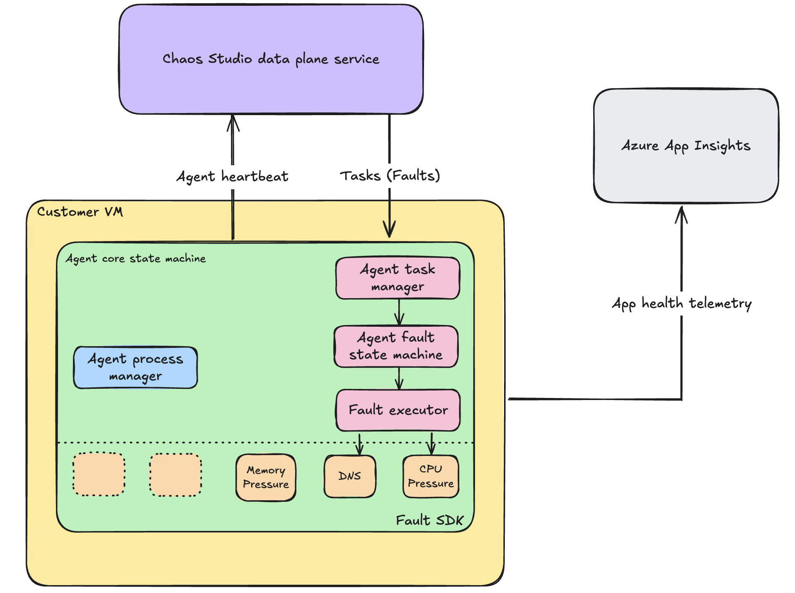

# Chaos Agent Overview

## Introduction

The **Chaos Agent** is a key component of [Azure Chaos Studio](https://azure.microsoft.com/services/chaos-studio/). It enables agent-based fault injection by running directly inside your target virtual machines (VMs). This approach allows you to simulate failure conditions that cannot be achieved through Azure’s control plane alone.

## Purpose

The purpose of the Chaos Agent is to introduce agent-based fault injection into your chaos experiments. Key benefits include:

- **Enhanced Fault Injection**: By operating inside the VM, the agent enables faults that mimic real-world scenarios more accurately.
- **Beyond Control Plane Limitations**: Some faults, such as deep system resource exhaustion, can only be induced from within the operating system.
- **Comprehensive Testing**: Test your applications against conditions like CPU and memory pressure, and network disruptions.

## How It Works

The Chaos Agent is shipped via VM extension and supports both Windows and Linux operating systems. Once deployed, it uses a managed identity to execute fault injection tasks directly on the target VM, allowing for:

- **Agent-Based Fault Injection**: Running inside the VM to trigger faults that cannot be simulated externally.
- **VM Extension Delivery**: Simplifies deployment across various environments.
- **Targeted Fault Scenarios**: Offers precise control over the induced faults, ensuring your systems are rigorously tested.

  

## Key Scenarios Enabled

The agent facilitates several critical fault injection scenarios, including:

- **CPU Pressure**: Simulate high CPU load conditions.
- **Memory Pressure**: Induce scenarios such as memory leaks or high memory utilization.
- **Network Faults**: Introduce network latency, packet loss, or disruptions.
- **Additional Faults**: Explore further fault scenarios to challenge system resiliency. [See our full fault library](chaos-studio-fault-library.md)

## Next Steps

This overview sets the stage for detailed documentation on configuring and using the Chaos Agent within your chaos experiments. For more in-depth guidance on setup, advanced configurations, and additional scenarios, refer to the subsequent sections of our documentation series.

---

For additional information, visit the [Azure Chaos Studio Documentation](index.yml).

