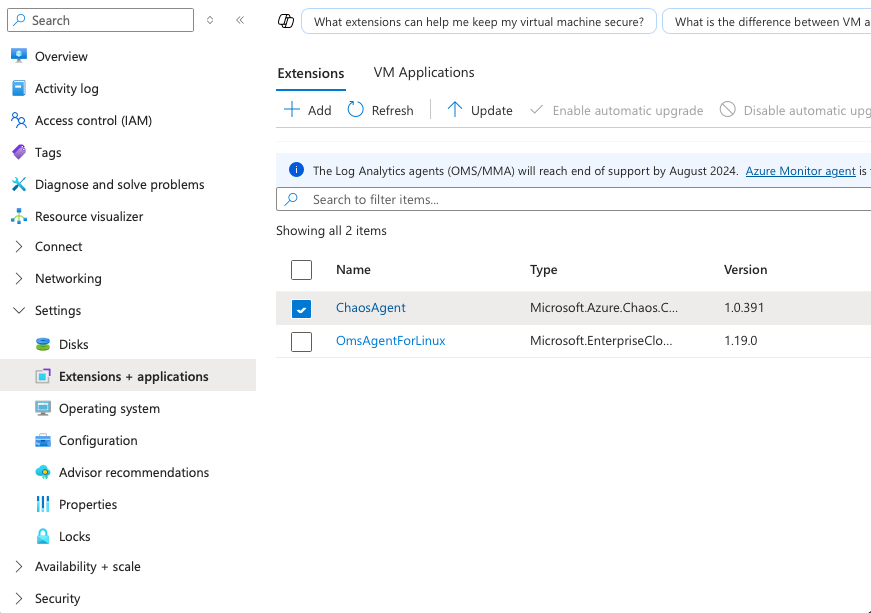

# Verify Chaos agent status

After installing the Chaos Agent on a virtual machine, verify that it's running correctly. This guide walks you through checking the agent's status in the Azure portal, understanding possible states, and troubleshooting potential issues.

## Check Chaos agent status in the Azure portal

1. Open the **Azure portal** and navigate to your virtual machine.
2. In the left-hand menu, select **Settings > Extensions + applications**.
3. Locate **ChaosAgent** in the list of installed extensions and select it.
<br>[](images/chaos-agent-status-1.png#lightbox)<br>

4. Check the following status fields:
   - **Status**: Should be `Provisioning succeeded`. If it shows `Provisioning failed`, the installation didn't complete successfully.
   - **Handler Status**: Should be `Ready`. If it's `Not Ready`, the agent couldn't connect to the Chaos Studio service.

If the **Handler Status** is `Not Ready`, this status typically indicates a **network or identity issue**. For more information, see the [Chaos Agent Troubleshooting Guide](troubleshooting.md).

<br>[](images/chaos-agent-status-2.png#lightbox)<br>

## Possible Chaos agent states and troubleshooting steps

### Success states
| State                    | Description                                    | Next steps |
|--------------------------|------------------------------------------------|------------|
| **Provisioning succeeded** | The agent was installed successfully. | No action needed. |
| **Handler Status: Ready** | The agent is running and connected to Chaos Studio. | You can proceed with running experiments. |

### Error states and troubleshooting
| Error message | Meaning | Resolution |
|--------------|---------|------------|
| **Failed to register agent due to credential error.** | The agent couldn't authenticate with Chaos Studio. | Ensure the virtual machine has a managed identity configured correctly. Follow the steps in [Create an experiment using an agent-based fault](chaos-studio-tutorial-agent-based-portal.md). |
| **Failed to register agent due to Network Exception.** | The agent is unable to reach the Chaos Studio data plane endpoint due to network restrictions. | Verify network settings to ensure outbound traffic to Chaos Studio endpoints isn't blocked. |
| **Failed to register agent due to API Exception.** | This error shouldn't occur if Chaos Studio is healthy. | If issues persist, contact support and verify that Chaos Studio service isn't having an outage. |

## Check Agent logs

If the agent isn't behaving as expected, check the logs for more details:

- **Windows**: Open **Event Viewer**, navigate to **Application logs**, and look for entries from the `AzureChaosAgent` source.
- **Linux**: To view logs run the following command:

  ```sh
  journalctl -u azure-chaos-agent --lines 50
  ```
