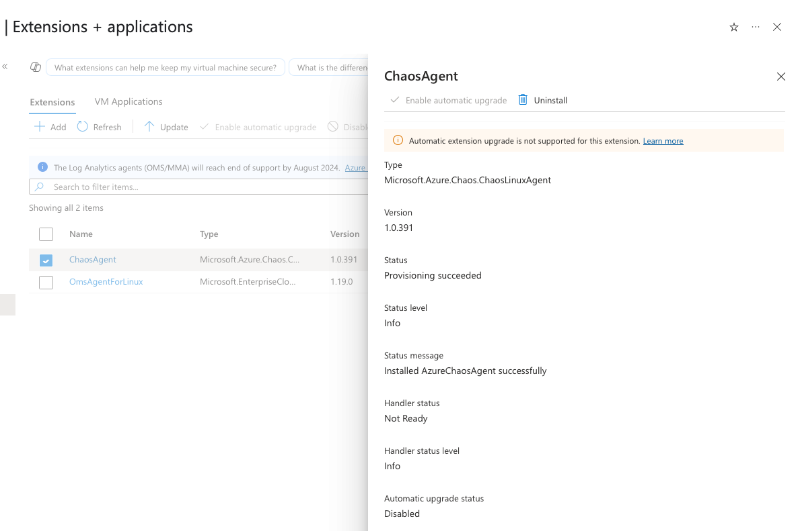

# Verify Chaos Agent Status

After installing the Chaos Agent on a virtual machine, verify that it is running correctly. This guide walks you through checking the agent's status in the Azure portal, understanding possible states, and troubleshooting potential issues.

## Check Chaos Agent Status in the Azure Portal

1. Open the **Azure portal** and navigate to your virtual machine.
2. In the left-hand menu, select **Settings > Extensions + applications**.
3. Locate **ChaosAgent** in the list of installed extensions and select it. [](images/chaos-agent-status-1.png#lightbox)
4. Check the following status fields:
   - **Status**: Should be `Provisioning succeeded`. If it shows `Provisioning failed`, the installation did not complete successfully.
   - **Handler Status**: Should be `Ready`. If it is `Not Ready`, the agent could not connect to the Chaos Studio service.

If the **Handler Status** is `Not Ready`, this typically indicates a **network or identity issue**. Refer to the [Chaos Agent Troubleshooting Guide](chaos-agent-troubleshooting.md) for more details.

[](images/chaos-agent-status-2.png#lightbox)

## Possible Chaos Agent States and Troubleshooting Steps

### Success States
| State                    | Description                                    | Next Steps |
|--------------------------|------------------------------------------------|------------|
| **Provisioning succeeded** | The agent was installed successfully. | No action needed. |
| **Handler Status: Ready** | The agent is running and connected to Chaos Studio. | You can proceed with running experiments. |

### Error States and Troubleshooting
| Error Message | Meaning | Resolution |
|--------------|---------|------------|
| **Failed to register agent due to credential error.** | The agent could not authenticate with Chaos Studio. | Ensure the virtual machine has a managed identity configured correctly. Follow the steps in [Create an experiment using an agent-based fault](chaos-studio-agent-based-portal.md). |
| **Failed to register agent due to Network Exception.** | The agent is unable to reach the Chaos Studio data plane endpoint due to network restrictions. | Verify network settings to ensure outbound traffic to Chaos Studio endpoints is not blocked. |
| **Failed to register agent due to API Exception.** | This error should not occur if Chaos Studio is healthy. Other errors (Credential or Network) typically cover this scenario. | Ensure the managed identity and network settings are correct. If issues persist, contact support. |

## Check Agent Logs

If the agent is not behaving as expected, check the logs for more details:

- **Windows**: Open **Event Viewer**, navigate to **Application logs**, and look for entries from the `AzureChaosAgent` source.
- **Linux**: Run the following command to view logs:

  ```sh
  journalctl -u azure-chaos-agent
  ```
