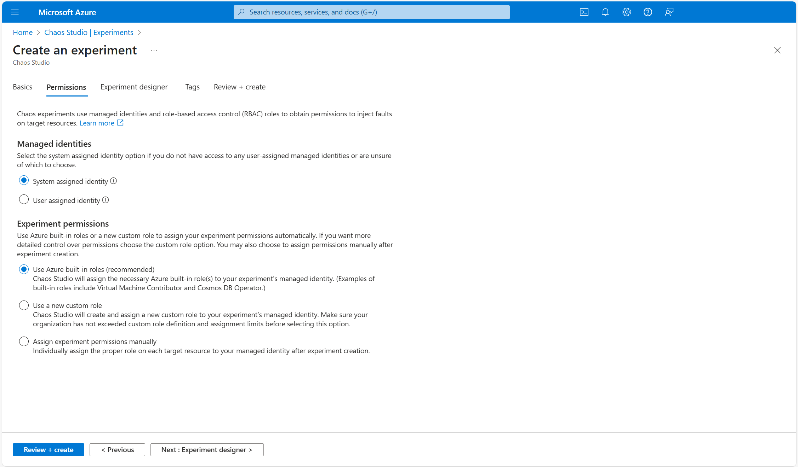
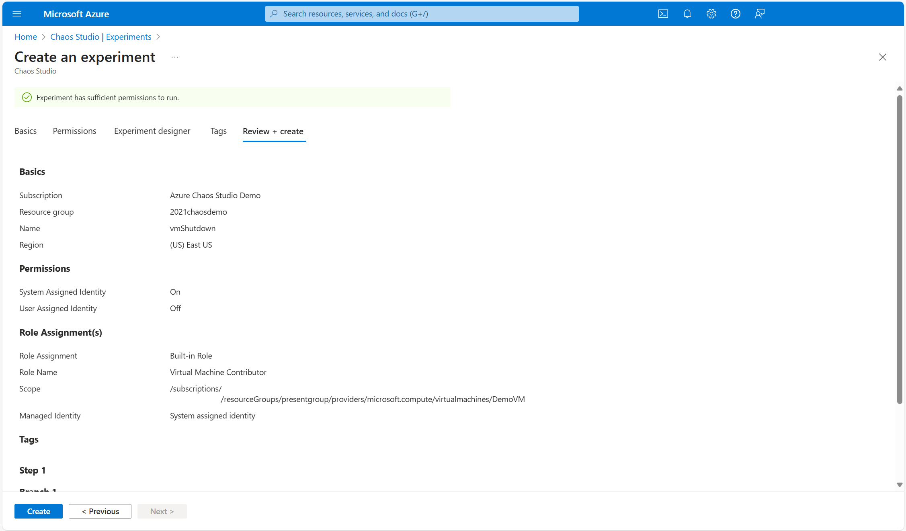
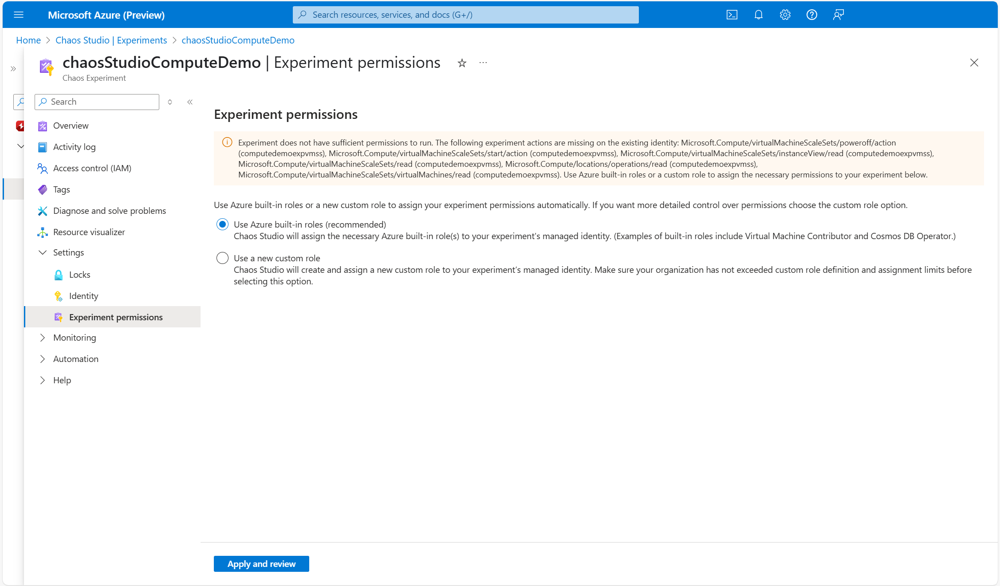

# Assigning experiment permissions in Azure Chaos Studio

Proper assignment of permissions is an essential part of configuring your experiments successfully in Azure Chaos Studio. Chaos experiments use managed identities and role-based access control to obtain the necessary permissions to inject faults on experiment targets. You can use Azure built-in roles or a custom role to assign the right permissions to your experiment's managed identity. When creating or editing your experiments in the Azure portal, you may use Chaos Studio's automatic role assignment functionality to easily assign, check, or update your experiment managed identity's access.

## Permissions assignment on experiment creation

When creating your experiment in the Azure portal, you may choose to assign your experiment permissions using Azure built-in roles, a new custom role, or opt out of automatic role assignment within the **"Experiment permissions"** section of the **Permissions** tab:

  

The following will happen on experiment deployment depending on the option you select to assign your experiment permissions:
* **"Use Azure built-in roles"**: If your experiment's managed identity doesn't already have the permissions to inject your selected faults, Chaos Studio performs role assignments on your experiment's managed identity using one or more Azure built-in roles based on the [faults and targets in your experiment](chaos-studio-fault-providers.md).
* **"Use a new custom role"**: If your experiment's managed identity doesn't already have the permissions to inject your selected faults, Chaos Studio performs a role definition and role assignment on your experiment's managed identity using a custom role based on the [faults and targets in your experiment](chaos-studio-fault-providers.md).
* **"Assign experiment permissions manually"**: No role definitions or role assignments occur on experiment deployment. You'll need to assign the proper permissions to your experiment's managed identity after it has been created.

If you choose to assign your experiment permissions using Azure built-in roles or a custom role, you'll get a summary of proposed permissions deployments within the **"Permissions"** section of the **Review + create** tab:

  

## Check and update experiment permissions

You can check if your experiment has sufficient permissions to run at any time within the **"Experiment permissions"** tab located in the **"Settings"** dropdown on your experiment's overview page. If your experiment doesn't have sufficient permissions to run, you'll be shown the specific Azure Resource Manager actions that are missing from its managed identity, along with the target that each action maps to in your experiment:

  

You may remediate your experiment by assigning the necessary permissions to its managed identity using Azure built-in roles or a custom role directly within the **"Experiment permissions"** tab:

  

> [!NOTE]
> In order to perform role assignments successfully, you must obtain or already have the **Role Based Access Control Administrator** Azure built-in role assigned to you.

## Next steps
Now that you understand how to assign experiment permissions within Chaos Studio, you're ready to:

- [Create and run your first experiment](chaos-studio-tutorial-service-direct-portal.md)

