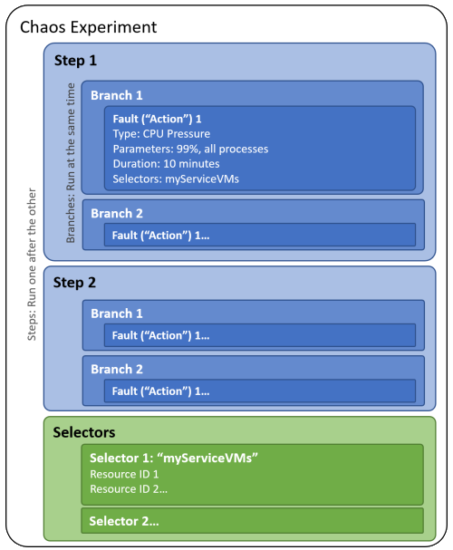

# What is Azure Chaos Studio?

[Azure Chaos Studio](https://azure.microsoft.com/services/chaos-studio) is a managed service that helps you validate the resilience of your Azure applications by injecting controlled disruptions — shutting down virtual machines, forcing database failovers, blocking DNS resolution, and more. You can use Chaos Studio to reproduce real outage patterns, verify that your recovery mechanisms work, and build evidence that your systems handle failure gracefully.

## Workspaces and Scenarios

The fastest way to get started is with a **Workspace**. A Workspace connects to your Azure environment through a scope (a subscription, resource group, or service group), discovers the resources you have deployed, and recommends **Scenarios** that simulate real outage patterns against those resources.

Workspaces are flexible — you can organize them however fits your team. Create one Workspace per application, one per environment (preproduction vs. production), one per team, or one per compliance boundary. The scope determines which resources the Workspace sees, so you control the blast radius at the Workspace level.

Each Scenario is a preconfigured resilience test. Instead of assembling individual Actions manually, you select a Scenario like **Compute Zone Down** or **DNS Outage** and Chaos Studio handles the Action composition, resource discovery, and sequencing. After the run completes, you get a **Scenario report** — a structured record of what happened, which you can use for compliance, retrospectives, or stakeholder communication.

Available Scenarios cover zone failures, database failovers, messaging disruptions, cache stampedes, nominal operations, and AI workload resilience. See [Scenarios in Azure Chaos Studio](chaos-studio-scenarios.md) for the full catalog.

To create your first Workspace and run a Scenario, see [Quickstart: Create a Workspace and run your first Scenario](quickstart-create-workspace.md).

## Experiments (classic)

For custom fault compositions that aren't covered by the Scenario catalog, you can create experiments directly. Experiments give you full control over steps, branches, actions, targets, and selectors. This is the original model for Chaos Studio, and existing experiments continue to work as before.

Chaos Studio supports two types of faults:

- **Service-direct** — Faults that run directly against an Azure resource through its management API, with no agent required. Examples include shutting down a virtual machine, triggering a SQL Database failover, or flushing a Redis cache.
- **Agent-based** — Faults that run inside a virtual machine or virtual machine scale set to inject in-guest failures like CPU pressure, memory pressure, or process kills.

Each fault has specific parameters you can configure. When you build an experiment, you define one or more *steps* that execute sequentially. Each step contains one or more *branches* that run in parallel. Each branch contains one or more *actions*, such as injecting a fault or waiting for a specified duration.

For a walkthrough of the experiment model, see [Chaos experiments in Azure Chaos Studio](chaos-studio-chaos-experiments.md).

## Chaos Studio AI plugin

The Chaos Studio AI plugin (`startchaos`) lets you create Workspaces, configure Scenarios, run them, and analyze the results through a conversational interface. The plugin works as both an interactive skill for GitHub Copilot CLI and as an MCP (Model Context Protocol) server that autonomous agents can call.

After a Scenario run completes, the plugin's impact analysis tool correlates Azure Monitor metrics, logs, and activity log events with the targeted resources, so you can see which signals moved during the test without building dashboards manually.

For setup instructions and the full tool reference, see the [Chaos Studio plugin repository](https://github.com/microsoft/chaos-studio-plugin).

## When to use Chaos Studio

Chaos Studio fits into several points in your development and operations lifecycle:

- **Incident reproduction** — After an outage, reproduce the failure pattern to verify that your fixes actually improve resilience.
- **Game days** — Before a major event, run Scenarios against your production or preproduction environment to validate that your systems handle expected failure modes.
- **Business continuity testing** — Validate failover behavior and recovery time objectives for disaster recovery plans.
- **Continuous validation** — Run Scenarios or experiments as deployment gates in your CI/CD pipelines to catch resilience regressions before they reach production.
- **Compliance evidence** — Use Scenario reports to help support evidence requirements for operational resilience frameworks such as DORA.

The following video provides more background about Chaos Studio:

> [!VIDEO https://aka.ms/docs/player?id=29017ee4-bdfa-491e-acfe-8876e93c505b]

## Next steps

- [Create a Workspace and run your first Scenario](quickstart-create-workspace.md)
- [Workspaces in Azure Chaos Studio](chaos-studio-workspaces-overview.md)
- [Scenarios in Azure Chaos Studio](chaos-studio-scenarios.md)
- [Create and run a chaos experiment](chaos-studio-tutorial-service-direct-portal.md)
- [Chaos engineering overview](chaos-studio-chaos-engineering-overview.md)
