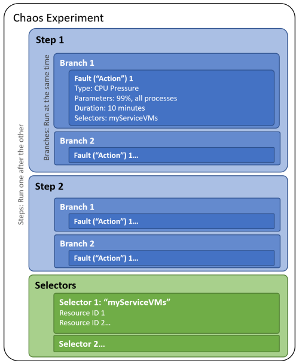

# What is Azure Chaos Studio?

Azure Chaos Studio is a managed service for chaos engineering and Azure resilience testing. Use [Chaos Studio Workspaces](chaos-studio-workspaces-overview.md), the current resource model, to discover resources, run Scenarios that simulate outages, and review Scenario reports. For requirements that need a generally available model or classic-only capabilities, [compare Workspaces and Experiments (classic)](chaos-studio-workspaces-vs-experiments.md).

[!INCLUDE [chaos-studio-workspaces-preview](includes/chaos-studio-workspaces-preview.md)]

## Chaos Studio Workspaces and Scenarios

The fastest way to get started is with a **Workspace**. A Workspace connects to your Azure environment through a scope (a subscription, resource group, or service group), discovers the resources you deployed, and recommends **Scenarios** that simulate real outage patterns against those resources.

Workspaces are flexible. You can organize them to fit your team: create one Workspace per application, preproduction environment, team, or compliance boundary. The scope determines which resources the Workspace discovers. [Workspace identity and permissions](chaos-studio-workspace-permissions.md) control which resources its Actions can affect.

Each Scenario is a preconfigured resilience test. Instead of assembling individual Actions manually, you select a Scenario like **Compute Zone Down** or **DNS Outage**, and Chaos Studio handles the Action composition, resource discovery, and sequencing. After the run completes, you get a [Scenario report](chaos-studio-scenario-reports.md), a structured record of what happened. Pair the report with application monitoring to assess recovery.

Available Scenarios cover zone and networking outages, database failovers, cache stampedes, and messaging disruptions. When the built-in templates don't fit your needs, use the **Scenario designer** to tailor a template into your own saved Scenario. See [Scenarios in Azure Chaos Studio](chaos-studio-scenarios.md) for the full catalog.

To create your first Workspace and run a Scenario, see [Quickstart: Create a Workspace and run your first Scenario](quickstart-create-workspace.md).

## Experiments (classic)

Experiments (classic) is the legacy resource model. Choose it when you need a generally available model or a fault composition or capability that the Scenario catalog doesn't cover. Microsoft no longer develops features for Experiments (classic) and considers only critical fixes, such as security updates, for backport.

Experiments (classic) supports two types of faults:

- **Service-direct**: Faults that run directly against an Azure resource through its management API, with no agent required. Examples include shutting down a virtual machine, triggering a SQL Database failover, or flushing a Redis cache.
- **Agent-based**: Faults that run inside a virtual machine or virtual machine scale set to inject in-guest failures like CPU pressure, memory pressure, or process kills.

Each fault has specific parameters you can configure. When you build an experiment, you define one or more *steps* that execute sequentially. Each step contains one or more *branches* that run in parallel. Each branch contains one or more *actions*, such as injecting a fault or waiting for a specified duration.

For a walkthrough of the legacy model, see [Azure Chaos Studio Experiments (classic)](chaos-studio-chaos-experiments.md).

## Chaos Studio AI plugin

The Chaos Studio AI plugin (`startchaos`) lets you create Workspaces, configure Scenarios, run them, and analyze the results through a conversational interface. The plugin works as both an interactive skill for GitHub Copilot CLI and as an MCP (Model Context Protocol) server that autonomous agents can call.

After a Scenario run completes, the plugin's impact analysis tool correlates Azure Monitor metrics, logs, and activity log events with the targeted resources, so you can see which signals moved during the test without building dashboards manually.

For setup instructions and the full tool reference, see the [Chaos Studio plugin repository](https://github.com/microsoft/chaos-studio).

## When to use Chaos Studio

Chaos Studio fits into several points in your development and operations lifecycle:

- **Incident reproduction**: After an outage, reproduce the failure pattern to verify that your fixes improve resilience.
- **Game days**: Before a major event, run Scenarios against a preproduction environment to validate that your systems handle expected failure modes.
- **Business continuity testing**: Validate failover behavior and recovery time objectives for disaster recovery plans.
- **Continuous validation**: Run Scenarios or experiments as deployment gates in your CI/CD pipelines to catch resilience regressions before they reach production.
- **Compliance evidence**: Use Scenario reports to help support evidence requirements for operational resilience frameworks such as DORA.

The following video provides more background about Chaos Studio:

> [!VIDEO https://aka.ms/docs/player?id=29017ee4-bdfa-491e-acfe-8876e93c505b]

[!INCLUDE [chaos-studio-feedback](includes/chaos-studio-feedback.md)]

## Next steps

- [Azure Chaos Studio Workspaces overview](chaos-studio-workspaces-overview.md).
- [Azure Chaos Studio Workspaces quickstart](quickstart-create-workspace.md).
- [Azure Chaos Studio Scenarios and outage templates](chaos-studio-scenarios.md).
- [Workspaces permissions and identity](chaos-studio-workspace-permissions.md).
- [Azure Chaos Studio Scenario reports](chaos-studio-scenario-reports.md).
- [Compare Workspaces and Experiments (classic)](chaos-studio-workspaces-vs-experiments.md).
- [Chaos engineering in Azure](chaos-studio-chaos-engineering-overview.md).
