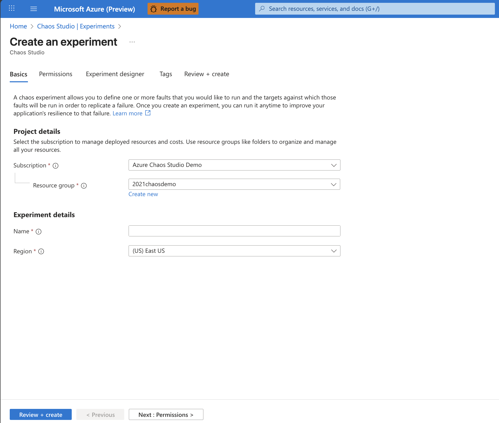
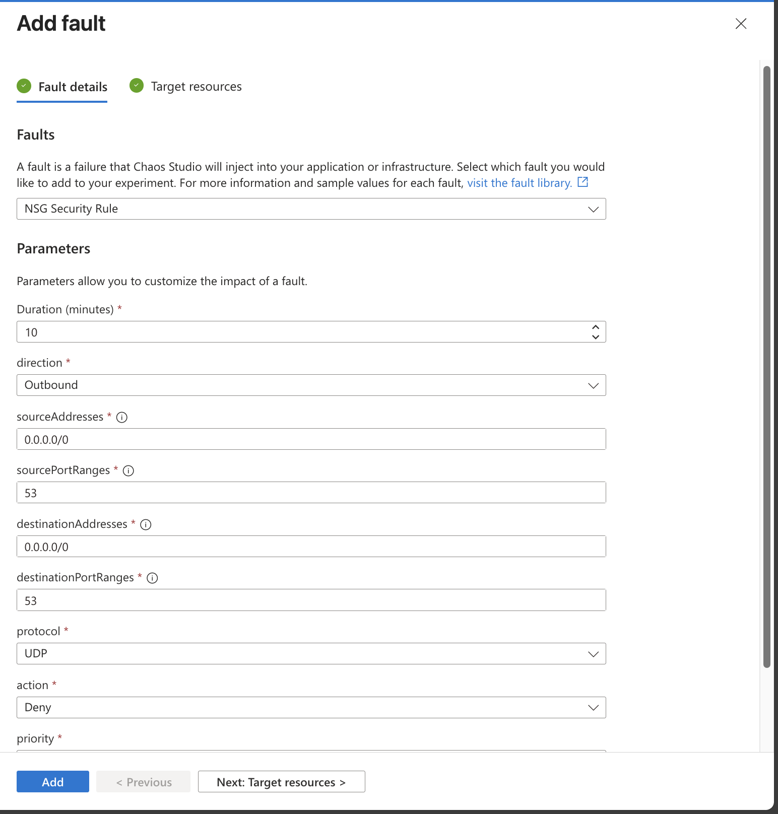

# Simulate a DNS outage with Azure Chaos Studio using a Network Security Group (NSG) Rule Fault

A healthy application depends on the ability to resolve hostnames quickly and reliably. But what happens if DNS — the backbone of service discovery on the Internet — becomes unavailable?

In this tutorial, you’ll use **Azure Chaos Studio** to simulate a **DNS outage** by blocking DNS traffic (port 53) through a temporary Network Security Group (NSG) rule. This experiment helps you understand how your application behaves when it can’t resolve hostnames and allows you to validate fallback or retry strategies before a real incident occurs.

## 📘 What you’ll learn

- How to simulate a DNS outage using an NSG rule fault  
- How to observe and measure application behavior during DNS failure  
- How to improve resiliency with DNS caching, multiple resolvers, and retry policies  

## 🧩 Prerequisites

Before you begin, make sure you have:

- An **Azure subscription** with permissions to create resources  
- A **virtual machine**, **VM scale set**, or **AKS cluster** where your application is running  
- **Network Security Group (NSG)** applied to your target subnet or NIC  
- The target onboarded into **Chaos Studio**

## 🧠 Scenario overview

In this simulation, you’ll temporarily block all outbound DNS traffic (UDP port 53) from a target resource. This effectively mimics a DNS outage and lets you see how your service handles failed lookups, degraded dependency calls, and recovery once DNS connectivity is restored.

**Example use case:**  
Your web app relies on external APIs, storage endpoints, and databases that require DNS name resolution. By blocking port 53, you can safely test how your app handles those failures and confirm whether your retry or caching logic works as expected.

## Pre-requisite: Enable Chaos Studio on your Network Security Group (NSG)

Azure Chaos Studio can't inject faults against a resource until that resource is added to Chaos Studio. To add a resource to Chaos Studio, create a [target and capabilities](chaos-studio-targets-capabilities.md) on the resource. Network security groups have only one target type (service-direct) and one capability (set rules). Other resources might have up to two target types. One target type is for service-direct faults. Another target type is for agent-based faults. Other resources might have many other capabilities.

1. Open the [Azure portal](https://portal.azure.com).
1. Search for **Chaos Studio** in the search bar.
1. Select **Targets** and find your network security group resource.
1. Select the network security group resource and select **Enable targets** > **Enable service-direct targets**.

      
1. Select **Review + Enable** > **Enable**.

You've now successfully added your network security group to Chaos Studio.

## 🧪 Step 1: Create a DNS outage Experiment

1. In the [Azure portal](https://portal.azure.com/), search for and select **Chaos Studio**.  
2. Select **Experiments → + Create**.  
3. Enter a name for your experiment, such as:  
   **`dns-outage-simulation`**
4. Choose a **resource group** and region for the experiment, then select **Next: Experiment design**.

## ⚙️ Step 2: Add the NSG rule fault

1. In the **Experiment design** tab, select **+ Add action**.  
2. Under *Fault type*, select **Network Security Group rule fault**.  
3. Configure the following parameters:

| Setting | Value |
|----------|--------|
| **Action** | Deny |
| **Protocol** | UDP |
| **Port range** | 53 |
| **Direction** | Outbound |
| **Target NSG** | Select the NSG attached to your target resource |
| **Duration** | 10 minutes (or as desired) |

This configuration denies all outbound UDP traffic on port 53 — effectively disabling DNS lookups for the target during the experiment.

## ▶️ Step 3: Run the Experiment

1. Review your configuration and select **Start experiment**.  
2. As the experiment runs, monitor:
   - Application logs and metrics in **Azure Monitor**
   - DNS lookup failures in **Application Insights**
   - Error patterns such as:
     - `ENOTFOUND`
     - `NXDOMAIN`
     - `TimeoutException`

3. When the experiment completes, Chaos Studio automatically removes the temporary NSG rule, restoring DNS access.

## 🔍 Step 4: Observe and analyze results

Evaluate how your application behaved during the outage:

- Did it fail gracefully or hang on lookups?  
- Were retries handled correctly?  
- Did latency increase for upstream dependencies?  
- Was there any cascading impact on other components?

Use dashboards, metrics, and custom logs to visualize the impact and identify improvement areas.

## 🛠️ Step 5: Strengthen your DNS resiliency

Based on what you learned, consider implementing one or more of the following:

- **Multiple resolvers** – Configure fallback DNS servers (Azure DNS + public resolvers like 1.1.1.1 or 8.8.8.8).
- **DNS last known good (LKG) plugin** - This plugin helps lengthen the time your app can run based on the last known good DNS without needing to fetch the latest from the authoritative server. 
- **Local caching** – Cache critical DNS entries in your app or VM resolver.
- **Retry logic** – Use exponential backoff and jitter when handling lookup failures.  
- **Private DNS zones** – For internal dependencies, resolve names privately to avoid public resolver reliance.  
- **Health checks** – Integrate DNS resolution checks in readiness/liveness probes.

