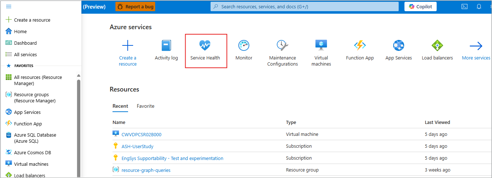

# Create Service Health alerts using the Azure portal

This article shows you how to use the Azure portal to set up Service Health alerts.  

Service Health notifications are stored in the [Azure activity log](../azure-monitor/essentials/platform-logs-overview.md). Given the large volume of information stored in the activity log, there is a separate user interface to make it easier to view and set up alerts on service health notifications. 

You can receive an alert when Azure sends Service Health notifications to your Azure subscription. You can configure the alert based on:

- The class of service health notification (Service issues, Planned maintenance, Health advisories, Security advisories)
- The subscription that is affected
- The services that are affected
- The regions that are affected

> [!NOTE]
> Service Health notifications do not send alerts for resource health events.

You also can configure who the alert should be sent to:

- Select an existing action group.
- Create a new action group (that can be used for future alerts).
> [!NOTE]
> Service Health Alerts are only supported in public clouds within the global region. For Action Groups to properly function in response to a Service Health Alert, the region of the action group must be set as "Global".

To learn more about action groups, see [Create and manage action groups](../azure-monitor/alerts/action-groups.md).

For information on how to configure service health notification alerts by using Azure Resource Manager templates, see [Resource Manager templates](../azure-monitor/alerts/alerts-activity-log.md).

## Create a Service Health alert using the Azure portal
1. In the [portal](https://portal.azure.com/), select **Service Health**.

    

1. In the **Service Issues** section, select **Create service health alert** to open a new window where you will fill in the information required to create the alert. Follow the steps in the [create a new alert rule wizard](../azure-monitor/alerts/alerts-create-activity-log-alert-rule.md?tabs=activity-log).
    
    

   If you need to add more detailed information for the service health alert click **Advanced Options** which will open the page **Create an alert rule** to start entering your data.

    

Learn how to [Configure webhook notifications for existing problem management systems](service-health-alert-webhook-guide.md). For information on the webhook schema for activity log alerts, see [Webhooks for Azure activity log alerts](../azure-monitor/alerts/activity-log-alerts-webhook.md).

## Next steps
- Learn about [best practices for setting up Azure Service Health alerts](https://learn-video.azurefd.net/vod/player?id=771688cf-0348-44c4-ba48-f36bcd0aba3f).
- Learn how to [setup mobile push notifications for Azure Service Health](https://learn-video.azurefd.net/vod/player?id=4a3171ca-2104-4447-8f4b-c4d27f6dfe96).
- Learn how to [configure webhook notifications for existing problem management systems](service-health-alert-webhook-guide.md).
- Learn about [service health notifications](service-notifications.md).
- Learn about [notification rate limiting](../azure-monitor/alerts/alerts-rate-limiting.md).
- Review the [activity log alert webhook schema](../azure-monitor/alerts/activity-log-alerts-webhook.md).
- Get an [overview of activity log alerts](../azure-monitor/alerts/alerts-overview.md), and learn how to receive alerts.
- Learn more about [action groups](../azure-monitor/alerts/action-groups.md).
