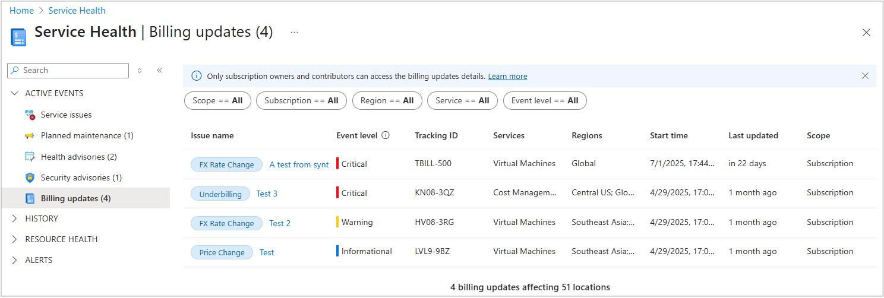
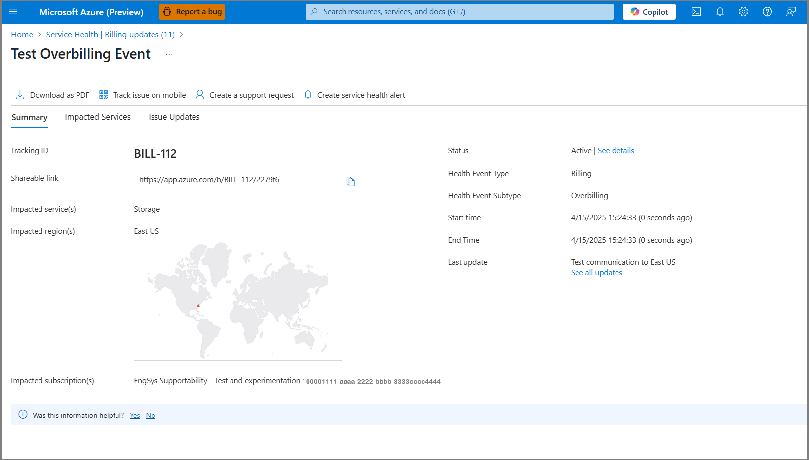

# Overview

The in-portal billing communication in [Service Health](service-health-overview.md) shows billing updates for users with the **subscription owner** or **subscription admin** roles. These users can view updates in both the **Billing Updates** pane and the Service Health API.

To help you track billing changes, the communication includes updates that relate to your subscription. Users without these roles can’t access the **Billing Updates** pane.

The **Billing Updates** pane includes billing communication types such as:

- Overbilling notifications
- Underbilling notifications
- Tax rate changes
- Foreign exchange rate changes
- Price changes

You can view up to three months of billing updates in the user interface and retrieve up to 12 months through the API. Billing communication events are available through the Service Health portal and the API.

**Requirements:**

- Subscription owner or subscription contributor role
- Access to the Service Health portal or API

## Access requirements

The detail pages for billing communication event types appear in the **Billing Updates** pane in [Service Health](service-health-overview.md). Only users with elevated access can open the pane.

To view the **Billing Updates** pane, you need one of the following roles:

- Subscription owner
- Subscription contributor
- Custom role with the required permissions

Users without access see a message instead of the pane.

## How to view billing events

Azure customers with any of the elevated accesses defined here can view billing communication events through the **Billing Updates pane**  in the [Service Health](service-health-overview.md) portal, and through the API access to retrieve billing event data,
  
  
or use an **Azure Resource Graph (ARG)** using supported queries.
  
  
