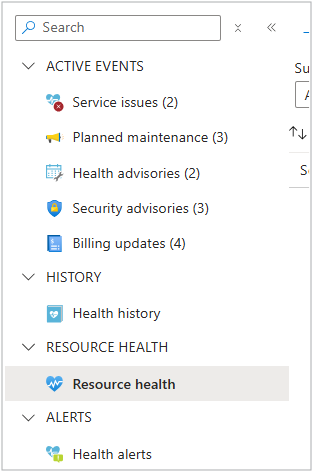

# Create Resource Health alerts in the Azure portal

## Overview

This article explains how to create Resource Health alerts in the Azure portal. These alerts notify you when the health status of your Azure resources changes. 

Azure Resource Health keeps you informed about the current and historical health status of your Azure resources. These alerts notify you when these resources have a change in their health status. Creating Resource Health alerts allows you to create and customize alerts in bulk.

### Resource Health notifications

Resource health notifications are stored in the [Azure activity log](../azure-monitor/essentials/platform-logs-overview.md). Given the possibly large volume of information stored in the activity log, there's a separate user interface to make it easier to view and set up alerts on resource health notifications.

You can receive an alert when Azure resource sends resource health notifications to your Azure subscription. You can configure an alert based on:

* The subscription affected.
* The resource types affected.
* The resource groups affected.
* The resources affected.
* The event statuses of the resources affected.
* The resources affected statuses.
* The reasons and types of the resources affected.


You can receive an alert when an Azure resource sends resource health notifications to your Azure subscription using your action groups. To configure the alert:

* Select an existing action group.
* Select a new action group that can be used for future alerts.


To learn more about action groups, see [Azure Monitor action groups](../azure-monitor/alerts/action-groups.md).

For information on how to configure resource health notification alerts by using Azure Resource Manager templates, see [Resource Manager templates](./resource-health-alert-arm-template-guide.md).

### [Azure portal](#tab/azureportal)

## Create a Resource Health alert rule in the Azure portal

1. In the Azure [portal](https://portal.azure.com/), select **Service Health**.


    

 
1. Select **Resource Health**.

     
   
1. Select **Add resource health alert**.
   

1. The **Create an alert rule** wizard opens the **Condition** tab, with the **Scope** tab already populated. 

1. Follow the steps to create Resource Health alerts, starting from the **Condition** tab, in the [Alert rule wizard](../azure-monitor/alerts/alerts-create-activity-log-alert-rule.md).

### [PowerShell](#tab/powershell)

### Using PowerShell

To follow the instructions on this page, you need to set up a few things in advance:

1. You need to install the [Azure PowerShell module](/powershell/azure/install-azure-powershell).
2. You need to [create or reuse an Action Group](../azure-monitor/alerts/action-groups.md) configured to notify you.


### Instructions for PowerShell

1. Use PowerShell to sign-in to Azure using your account, and select the subscription you want to interact with.

    ```azurepowershell
    Login-AzAccount
    Select-AzSubscription -Subscription <subscriptionId>
    ```
    > [!NOTE]
    > You can use `Get-AzSubscription` to list the subscriptions you have access to.

1. Find and save the full Azure Resource Manager ID for your Action Group.

    ```azurepowershell
    (Get-AzActionGroup -ResourceGroupName <resourceGroup> -Name <actionGroup>).Id
    ```


3. Create and save a Resource Manager template for Resource Health alerts as `resourcehealthalert.json` ([see details](#resource-manager-template-options-for-resource-health-alerts))


1. Create a new Azure Resource Manager deployment using this template.

    ```azurepowershell
    New-AzResourceGroupDeployment -Name ExampleDeployment -ResourceGroupName <resourceGroup> -TemplateFile <path\to\resourcehealthalert.json>
    ```


5. You're prompted to type in the Alert Name and Action Group Resource ID you copied earlier:

    ```azurepowershell
    Supply values for the following parameters:
    (Type !? for Help.)
    activityLogAlertName: <Alert Name>
    actionGroupResourceId: /subscriptions/<subscriptionId>/resourceGroups/<resourceGroup>/providers/microsoft.insights/actionGroups/<actionGroup>
    ```

6. If everything worked successfully, you get a confirmation in PowerShell

    ```output
    DeploymentName          : ExampleDeployment
    ResourceGroupName       : <resourceGroup>
    ProvisioningState       : Succeeded
    Timestamp               : 11/8/2017 2:32:00 AM
    Mode                    : Incremental
    TemplateLink            :
    Parameters              :
                            Name                     Type       Value
                            ===============          =========  ==========
                            activityLogAlertName     String     <Alert Name>
                            activityLogAlertEnabled  Bool       True
                            actionGroupResourceId    String     /...

    Outputs                 :
    DeploymentDebugLogLevel :
    ```


> [!NOTE]   
> If you're planning on fully automating this process, you simply need to edit the Resource Manager template to not prompt for the values in Step 5.
## Next steps

Learn more about Resource Health:

* [Azure Resource Health overview](Resource-health-overview.md)
* [Resource types and health checks available through Azure Resource Health](resource-health-checks-resource-types.md)

Create Service Health Alerts:

* [Configure Alerts for Service Health](./alerts-activity-log-service-notifications-portal.md) 
* [Azure Activity Log event schema](../azure-monitor/essentials/activity-log-schema.md)
* [Configure resource health alerts using Resource Manager templates](./resource-health-alert-arm-template-guide.md)
